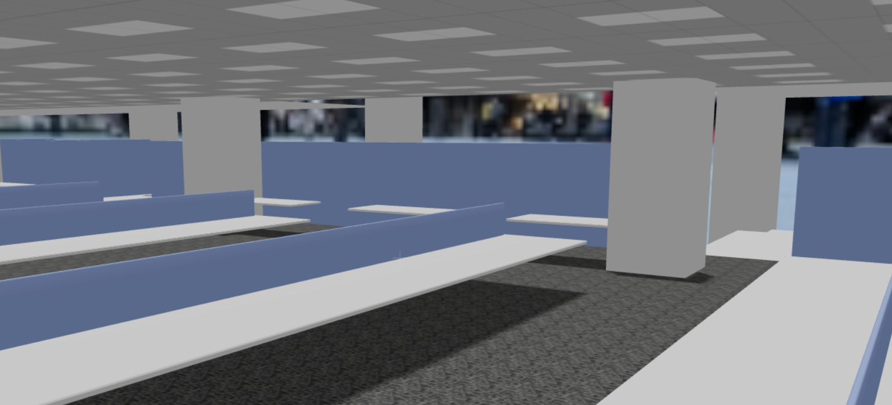

# XRift World - 仮想オフィス（中）

現実に存在するかもしれない、中小規模の仮想オフィス空間です。




s## 概要

このプロジェクトは、[XRift](https://xrift.jp)プラットフォームで動作するWebXRワールドです。React Three FiberとRapier物理エンジンを使用して構築されています。

## 特徴

- 🏢 リアルなオフィス環境
- 🌆 360度パノラマスカイボックス（東京駅周辺）
- 🪑 床・壁・天井のテクスチャ表現
- ⚡ 物理エンジンによるリアルな当たり判定

## 技術スタック

- [React Three Fiber](https://docs.pmnd.rs/react-three-fiber/) - React向けThree.jsレンダラー
- [React Three Drei](https://github.com/pmndrs/drei) - React Three Fiber用ヘルパー
- [React Three Rapier](https://github.com/pmndrs/react-three-rapier) - 物理エンジン
- [Vite](https://vitejs.dev/) - 高速ビルドツール
- [Module Federation](https://module-federation.io/) - 動的モジュールローディング

## 開発

### 前提条件

- Node.js 18以上
- npm または yarn

### セットアップ

```bash
# 依存関係のインストール
npm install

# 開発サーバー起動
npm run dev
```

開発サーバーは http://localhost:5173 で起動します。

### ビルド

```bash
# プロダクションビルド
npm run build

# 型チェック
npm run typecheck
```

### XRiftへのアップロード

```bash
# XRift CLIを使用してアップロード
xrift upload world
```

## プロジェクト構成

```
fkym-office/
├── public/                 # 静的アセット
│   ├── textures/          # テクスチャファイル
│   │   ├── ceiling.png    # 天井テクスチャ
│   │   ├── floor.png      # 床テクスチャ
│   │   └── wall.png       # 壁テクスチャ
│   ├── thumbnail.png      # サムネイル画像
│   └── tokyo-station.jpg  # スカイボックス用360度画像
├── src/
│   ├── components/        # 3Dコンポーネント
│   │   ├── Land/         # 地面コンポーネント
│   │   ├── Skybox/       # スカイボックス
│   │   └── WallBase/     # 壁コンポーネント
│   ├── constants.ts      # 定数定義
│   ├── dev.tsx           # 開発用エントリーポイント
│   ├── index.tsx         # 本番用エクスポート
│   └── World.tsx         # メインワールドコンポーネント
├── xrift.json            # XRift設定ファイル
└── vite.config.ts        # Vite設定
```

